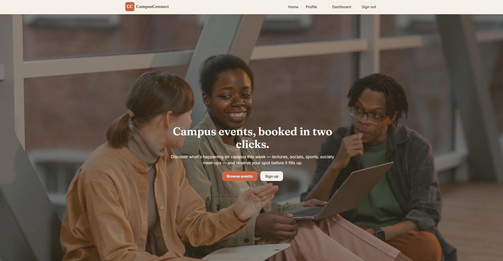
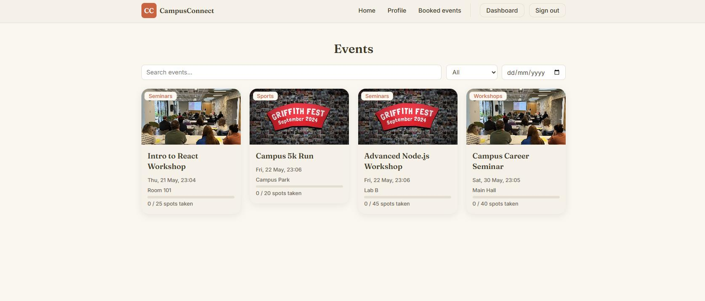
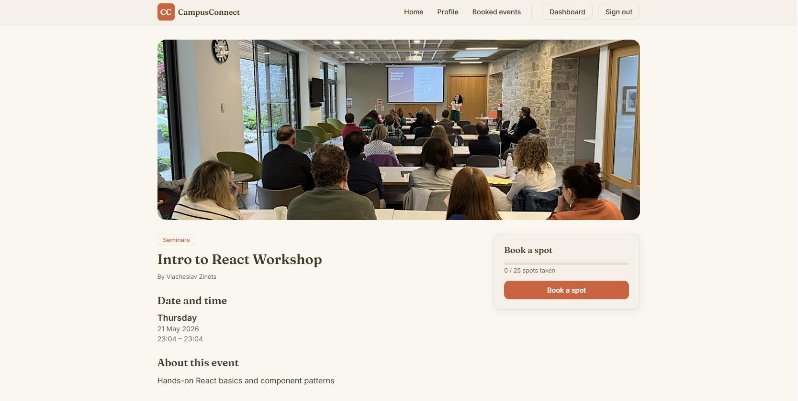
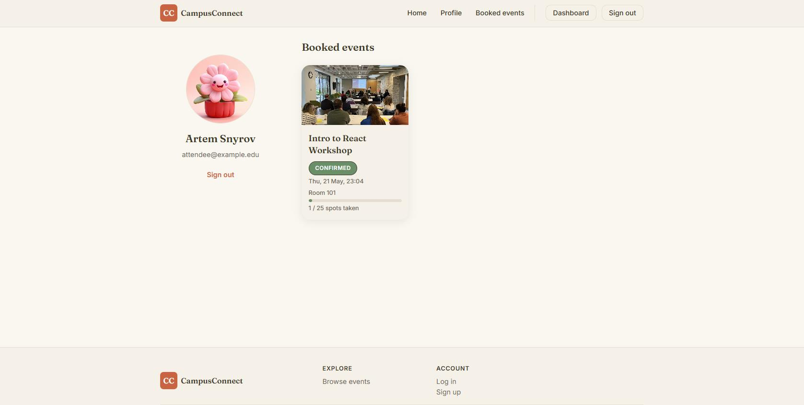
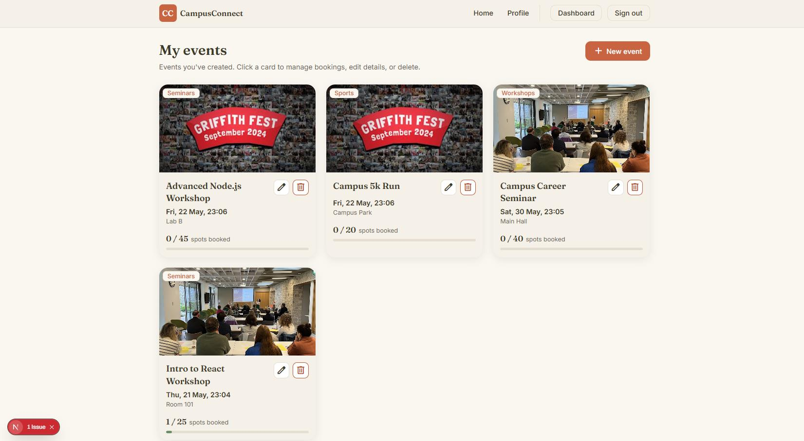
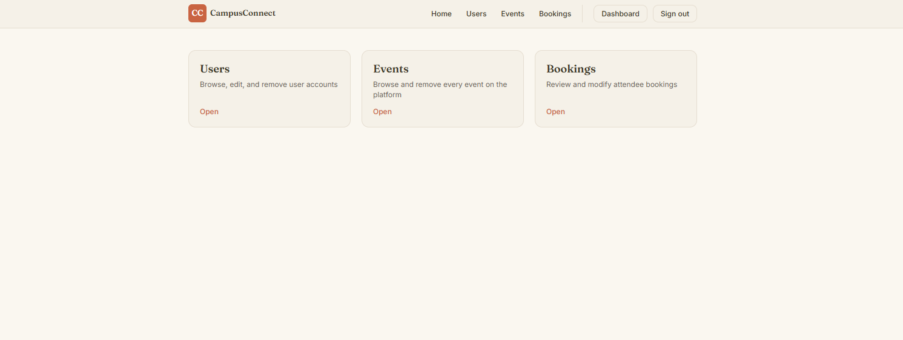

# CampusConnect

A full-stack campus events platform built with Next.js (App Router) and MySQL. Students browse and book spots at campus events (lectures, socials, sports, society meet-ups); organisers publish and manage their own events; admins oversee every user, event and booking on the platform.

Built as a 3-person group project for a Server-Side Web Development module — see [Team](#team) below.



## Features

**Accounts & roles**
- Registration and login with bcrypt-hashed passwords
- Sessions handled via a signed JWT (`jose`) stored in an HTTP-only cookie
- Three roles — Attendee, Organiser, Admin — each with its own layout and dashboard

**Events**
- Organisers create, edit and delete their own events (title, description, category, location, capacity, cover photo)
- Attendees browse and filter events by category, date and free-text search

**Bookings**
- Attendees book a spot in one click; capacity is enforced server-side
- A database-level unique constraint (`user_id`, `event_id`) plus server-side checks prevent double-booking
- Attendees can view and cancel their confirmed bookings from a "Booked events" page

**Admin**
- Dedicated dashboard to browse, edit and remove any user, event or booking on the platform

**Other**
- Server-side validation on every API input
- Mobile-first responsive layout (360px–1024px)

## Screenshots

| Browse events | Event details & booking |
|---|---|
|  |  |

| My bookings | Organiser dashboard |
|---|---|
|  |  |

**Admin dashboard**



## Tech stack

- **Framework:** Next.js 16 (App Router), React 19
- **Database:** MySQL, accessed via `mysql2`
- **Auth:** `bcrypt` for password hashing, `jose` for signed session JWTs
- **Styling:** CSS Modules
- **Icons:** react-icons

## Project structure

```
src/
  app/
    (main)/         guest-facing pages (home)
    (auth)/         login, register — no header/footer layout
    (dashboard)/    attendee/ and organiser/ pages and layouts
    (admin)/        admin dashboard, user/event/booking management
    api/            auth, events, bookings, users, categories routes
  components/       feature components (events, bookings, profile, admin, ui)
  lib/
    db.js           mysql2 connection pool
    auth/           session/current-user helper
  assets/           bundled images (event placeholders, etc.)
database/
  schema.sql        table definitions
  seed.sql          sample categories/users/events/bookings for local dev
```

## Getting started

**Prerequisites:** Node.js, a running MySQL server.

1. Install dependencies:
   ```bash
   npm install
   ```
2. Create the database and load the schema and seed data:
   ```bash
   mysql -u <user> -p < database/schema.sql
   mysql -u <user> -p < database/seed.sql
   ```
3. Create a `.env.local` file in the project root:
   ```
   DB_HOST=localhost
   DB_PORT=3306
   DB_USER=<your-mysql-user>
   DB_PASSWORD=<your-mysql-password>
   DB_NAME=campusconnect
   SESSION_SECRET=<a-long-random-string>
   ```
4. Run the dev server:
   ```bash
   npm run dev
   ```
5. Open [http://localhost:3000](http://localhost:3000).

`seed.sql` creates one account per role (`admin`, `organiser`, `attendee`) with a shared placeholder password — check the file for the exact emails before logging in locally.

## Team

- Artem Shnyrov — database design, server-side utilities, API routes
- Maksym Chechotkin — attendee/organiser frontend, API integration
- Viacheslav Zinets — layouts and auth pages, admin dashboard, admin API integration, testing
